# Setting up a private blockchain with Ethereum

Setting up a private blockchain with ethereum has two parts:

1. Setting up a virtual private cloud on AWS
2. Running blockchain nodes on the private network.

## Setting up a virtual private cloud on AWS

If you are not familiar with the Virtual Private Cloud (VPC) concept, we
recommend you to start with [What is Amazon VPC?] User Guide from Amazon.
If you just need some refreshment, below we copied some basic information
about Amazon VPCs.

> A *virtual private cloud* (VPC) is a virtual network dedicated to your
AWS account. It is logically isolated from other virtual networks in the AWS
cloud. You can launch your AWS resources, such as Amazon EC2 instances, into
your VPC. You can configure your VPC; you can select its IP address range,
create subnets, and configure route tables, network gateways, and security
settings.
>
> A *subnet* is a range of IP addresses in your VPC. You can launch AWS
resources into a subnet   that you select. Use a public subnet for resources
that must be connected to the Internet, and a private subnet for resources
that won't be connected to the Internet. For more information about public and
private subnets, see [VPC and Subnet Basics].
>
> To protect the AWS resources in each subnet, you can use multiple layers of
security, including security groups and network access control lists (ACL).
For more information, see [Security].

Our blockchain nodes will form a private network but some nodes need to be
accessible from outside - for instance to connect to a node using its RPC
interface.

> We'll use unsecured connection to the nodes, making sure that a node only
exposes suitable parts of its RPC modules. Later we plan to use SSL to further
secure the communication between the selected nodes and external clients.

Knowing that, we will use a VPC with a public subnet in one availability zone.

> AWS regions and availability zones can be used to increase fault-tolerance of
the network. In our initial setup we do not take advantage of multi region,
multi-zone setup. This may be added to our solution later.
To learn more about AWS regions and availability zones, please consult
[Regions and Availability Zones] on Amazon.

[What is Amazon VPC?]: http://docs.aws.amazon.com/AmazonVPC/latest/UserGuide/VPC_Introduction.html
[VPC and Subnet Basics]: http://docs.aws.amazon.com/AmazonVPC/latest/UserGuide/VPC_Subnets.html#vpc-subnet-basics
[Security]: http://docs.aws.amazon.com/AmazonVPC/latest/UserGuide/VPC_Security.html
[Regions and Availability Zones]: http://docs.aws.amazon.com/AWSEC2/latest/UserGuide/using-regions-availability-zones.html

### Before you begin

Make sure you have an Amazon AWS account with sufficient privileges.
First select the region  you want to be in. In our tutorial we use `eu-central-1`,
which is EU (Frankfurt).

> The region is always from the right-upper corner of your Amazon AWS account.

Once you have decided and selected the region you want to be in,
you need to create a key pair you will use to access EC2 instances that you
launch into your VPC. The public key will be stored on your instance
while the private key will be downloaded to your browser so that you can store
it locally.

> You cannot access your instance without the private key.
Keep it safe and secure on your machine (think about doing
`chmod 400 <private-key-file>`).

To create your key pair on Amazon AWS follow these steps:

1. Go to *Services* > *EC2* > *Network & Security* > *Key Pairs*
2. Create key pair. Give your key pair a descriptive name, eg. *blockchainlab*.
3. The private key will be automatically downloaded to your browser.
Archive this file and make sure it is secured.

> You can also use an existing key-pair. Check [Importing Your Own Public Key
to Amazon EC2] and [Retrieving the Public Key for Your Key Pair on Linux]
for more information.

[Importing Your Own Public Key to Amazon EC2]: http://docs.aws.amazon.com/AWSEC2/latest/UserGuide/ec2-key-pairs.html#how-to-generate-your-own-key-and-import-it-to-aws
[Retrieving the Public Key for Your Key Pair on Linux]: http://docs.aws.amazon.com/AWSEC2/latest/UserGuide/ec2-key-pairs.html#retrieving-the-public-key

### Creating VPC

We create a VPC that reflects the [Recommended VPC and subnet setup] 
from Docker documentation:

**VPC**

```
CIDR: 172.31.0.0/16
DNS hostnames: yes
DNS resolution: yes
DHCP option set: DHCP Options (Below)
```

**INTERNET GATEWAY**

```
VPC: VPC (above)
```

**DHCP OPTION SET**

```
domain-name: ec2.internal
domain-name-servers: AmazonProvidedDNS
```

**SUBNET1**

```
CIDR: 172.31.16.0/20
Auto-assign public IP: yes
Availability-Zone: A
```

**SUBNET2**

```
CIDR: 172.31.32.0/20
Auto-assign public IP: yes
Availability-Zone: B
```

**SUBNET3**

```
CIDR: 172.31.0.0/20
Auto-assign public IP: yes
Availability-Zone: C
```

**ROUTE TABLE**

```
Destination CIDR block: 0.0.0.0/0
Subnets: Subnet1, Subnet2, Subnet3
```

We will start with one public subnet as this is convenient to do using
the *Start VPC Wizard*. This will provide us with the initial setup which we
will extend to match the Docker recommendations.

#### Create VPC with a Single Public Subnet

Go to *Services* > *VPC* and click on *Start VPC Wizard*.
We will use the first configuration: *VPC with a Single Public Subnet*:

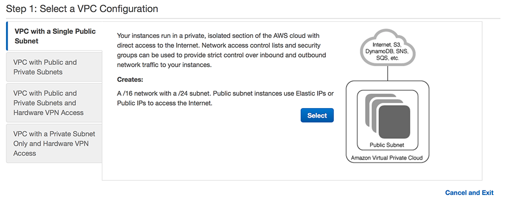

> For all recently new AWS accounts, there already is one *default* VPC.
A default VPC is suitable for getting started quickly, but here,
in perspective, we want to be able to support our specific requirements and
for that reason we immediately proceed with a nondefault VPC.
For more information, consult [Default VPC and Default Subnets] in the AWS
documentation.

Click *Select*.

#### Setup VPC and public subnet

Set `172.31.0.0/16` as `IPv4 CIDR block`, `VPC Name` to `blockchainlab-vpc`
(you can use any name you want), `Public subnet's IPv4 CIDR` to `172.31.16.0/20`,
`Availability Zone` to `eu-central-1a`, and `Subnet name` to `Subnet1` as on
the picture below:

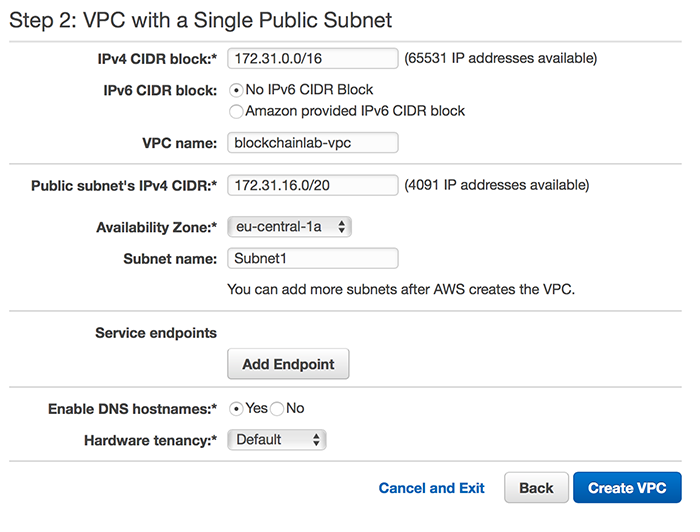

Amazon recommends the CIDR blocks from the private IPv4 address ranges as
specified in [RFC 1918]:

  - `10.0.0.0` - `10.255.255.255` (`10/8` prefix)
  - `172.16.0.0` - `172.31.255.255` (`172.16/12` prefix)
  - `192.168.0.0` - `192.168.255.255` (`192.168/16` prefix).

For more information check [VPC and Subnet Sizing for IPv4].

Click *Create VPC* and confirm with *OK* in the next screen.
You will see you new nondefault VPC in *Your VPCs* group.

#### Create two other subnets

Select *Subnets* from the left panel and click on *Create Subnet* button:

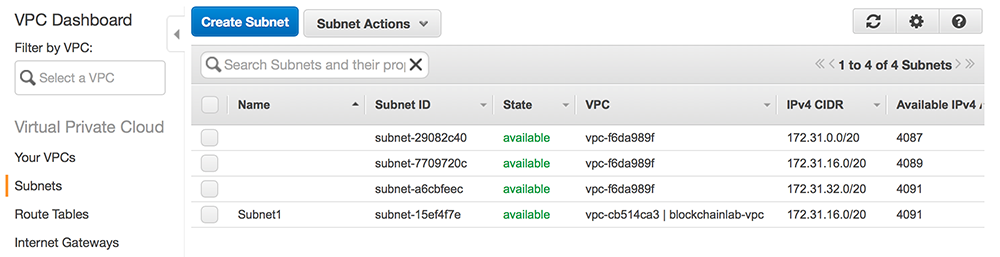

Fill in `Subnet2` for *Name tag*, select `blockchainlab-vpc` as *VPC* and 
`eu-central-1b` as *Availability Zone*. Fill in `172.31.32.0/20` as *172.31.32.0/20*:

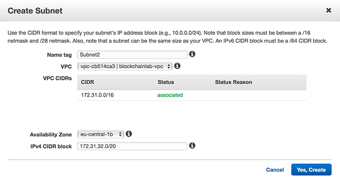

Analogically, create `Subnet3`:

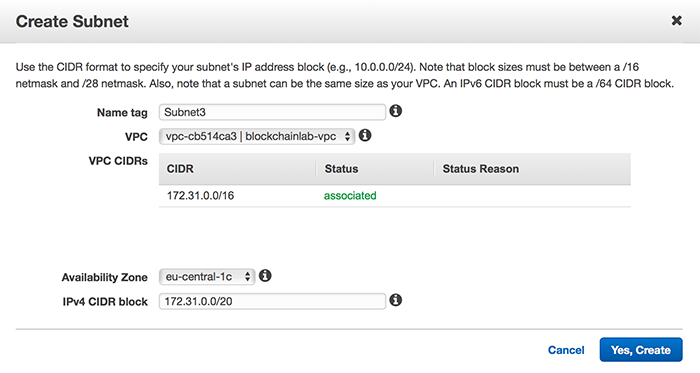

#### Auto-assign public IPs

Finally, to make sure that all our instances are externally accessible,
we enable *Auto-assign Public IP* for our subnets. To do so, first select 
`Subnet1` from the list of subnets and select 
*Modify auto-assign IP settings* from the *Subnet Actions* menu:

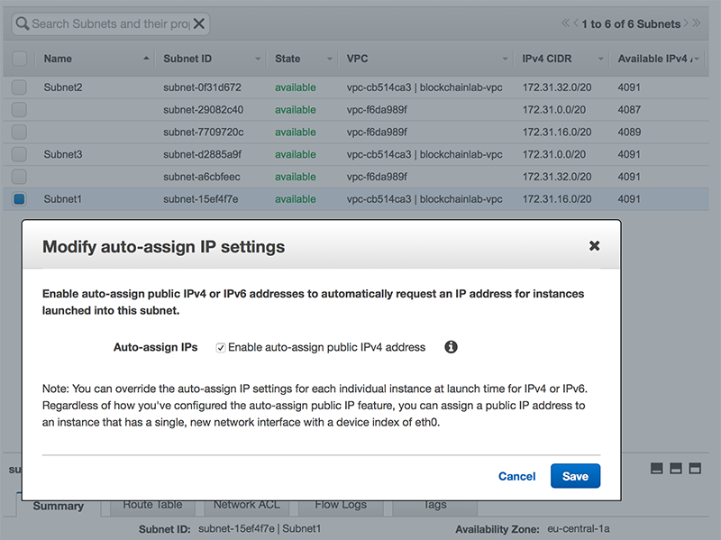

Repeat the procedure for `Subnet2`, `Subnet3`.

> We may want to restrict this option later, instead of assigning public IP to
all instances running in a subnet we may want to assign public IPs
(e.g. by using [Elastic IPs]) to only selected instances.

#### Create and assign DHCP Option Set to VPC

Finally, we will setup a separate, recommended by Docker, *DHPC Option Set*. 
Select *DHCP Option Sets* and then click *Create DHCP
Option Set*. Set *Name tag* to any name of your choice (e.g.
`blockchainlab-dhcp-options-set`), *Domain name* to `ec2.internal`, and
*Domain name servers* to `AmazonProvidedDNS`:

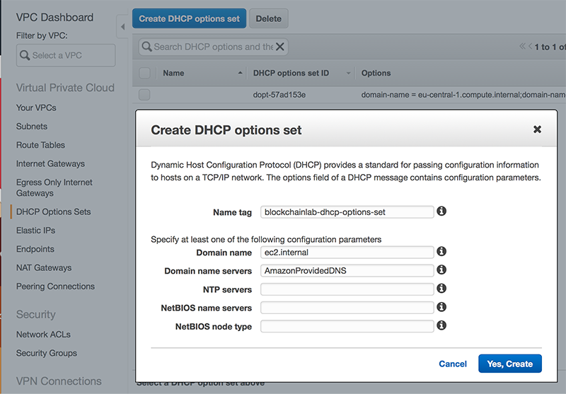

Click *Yes, Create*. To assign the newly created option set to our nondefault
VPC, select the VPC in *Your VPCs* group and select *Edit DHCP Options Set*
from the *Actions* menu:

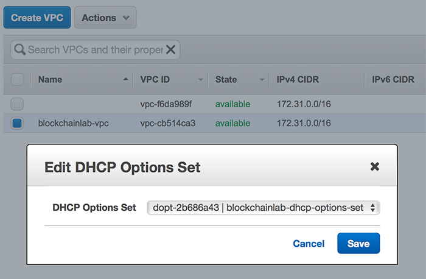

#### Associate Subnet2 and Subnet3 with Route Table

Because we used a wizard to create VPC with one public subnet, `Subnet1` is already
associated with our router. We need to make sure that `Subnet2` and `Subnet2` are
also associated. Select *Route Tables* in the left panel, select the Route Table
associated with `blockchainlab-vpc` and then choose the *Subnet Associations* in the
details panel:

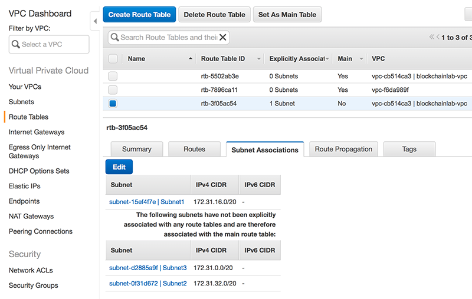

Click *Edit* and make sure that all subnets are associated:

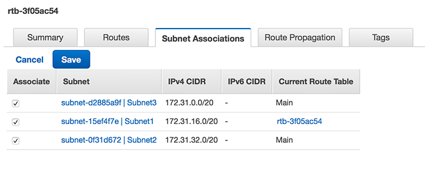

Confirm with *Save*.

This concludes initial setup of our VPC. Later, we will still modify
the *Security Group* associated with our VPC in order to set suitable
constraints for the inbound and outbound traffic.
For now, our VPC has a default security group assigned. This group was created
automatically when we created VPC and it sets unrestricted outbound
traffic and allows inbound traffic from instances assigned to the same
security group.

> To learn more about security groups check [Security Groups for Your VPC] in
the AWS documentation.

[Recommended VPC and subnet setup]: https://docs.docker.com/docker-for-aws/faqs/#recommended-vpc-and-subnet-setup
[Default VPC and Default Subnets]: http://docs.aws.amazon.com/AmazonVPC/latest/UserGuide/default-vpc.html
[RFC 1918]: http://www.faqs.org/rfcs/rfc1918.html
[VPC and Subnet Sizing for IPv4]: http://docs.aws.amazon.com/AmazonVPC/latest/UserGuide/VPC_Subnets.html#vpc-sizing-ipv4
[Elastic IPs]: http://docs.aws.amazon.com/AmazonVPC/latest/UserGuide/vpc-eips.html
[Security Groups for Your VPC]: http://docs.aws.amazon.com/AmazonVPC/latest/UserGuide/VPC_SecurityGroups.html

## Running blockchain nodes on the private network.

> NOTE: Docker Cloud will be discontinued on May 25 2018 so the following text is here for reference.

Having our VPC ready, we can now create our SWARM using Docker Cloud. Login to your docker cloud account (create one if you do not already have one), and in the *Swarms* panels select *Create*.

> If you haven't done it before, you will need to connect you AWS account to Docker Cloud. Follow the instructions in [Link Amazon Web Services to Docker Cloud](https://docs.docker.com/docker-cloud/cloud-swarm/link-aws-swarm/) in Docker documentation.

Give your Swarm a descriptive name, and select `Stable` as the docker version that will be used with this swarm. In our example we use *Frankfurt* region.

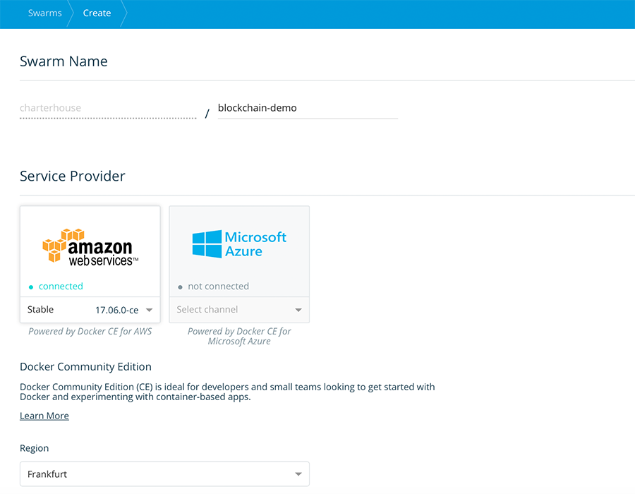

Next, in *Region Advanced Settings* select the `blockchainlab-vpc` from the list and fill in the remaining fields accordingly as shown in the picture below:

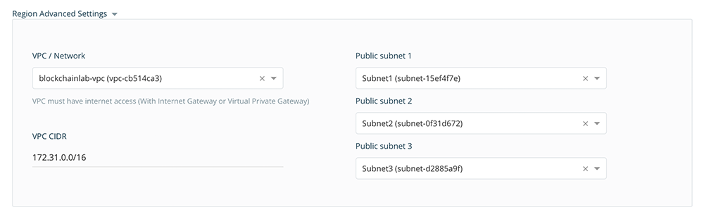

Next set the Swarm Size to use one manager and four worker nodes, and select the right ssh key to be used for your account (the same that we created in Section *Before you begin* above):

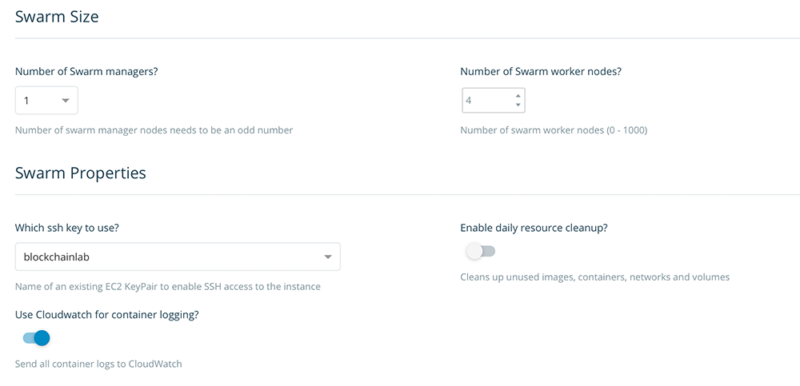

Finally, set the Swarm Manager and Swarm Worker properties. We use a `t2.micro` instance for the manager (where we only intend to run the bootnode and the visualizer), and `t2.medium` for the worker nodes:

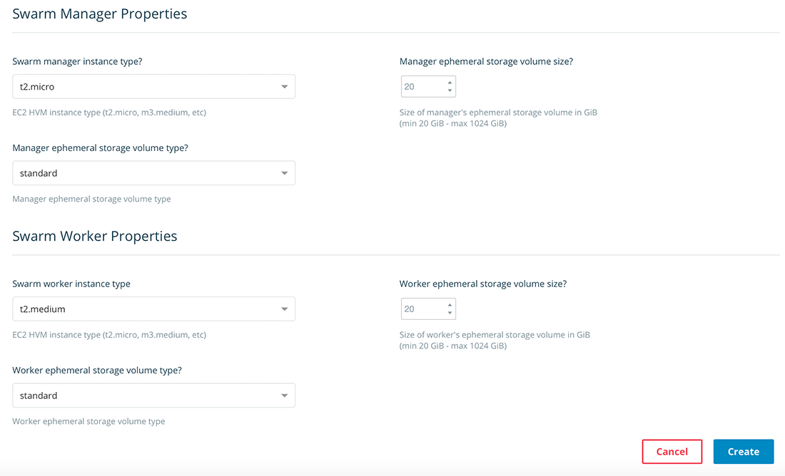

Click *Create*. Docker Cloud will start creating the Swarm on your AWS account. Please be patient. It may take some time (usually less than 10 minutes). A green dot next to your Swarm name will stop blinking when Swarm is ready.

After Swarm is created, you will see the following EC2 instances on your AWS account:

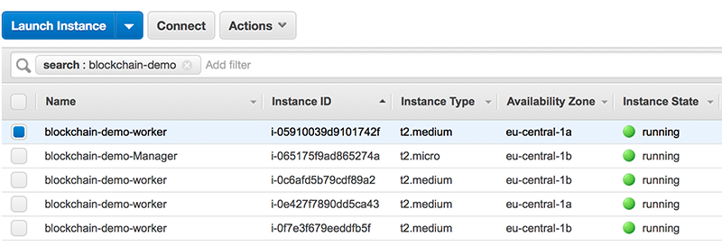

### Updating Security Groups for EC2 instances

Docker Cloud does a pretty good job. The Swarm is ready to start deploying our stacks, yet, it does not know what kind of services we are going to deploy and which additional ports need to be exposed. 

Docker cloud creates the following Security Groups: `blockchain-demo-SwarmWide`, `blockchain-demo-ManagerVpc`, `blockchain-demo-ExternalLoadBalancer`, and `blockchain-demo-NodeVpc`. In order to have access to visualizer we need expose port `8080` on the `blockchain-demo-ManagerVpc` security group. Because visualizer uses ingress port publishing, we can access it using public DNS address (or public IP) of any node in our Swarm. For this to work we need to expose port `8080` also in the `blockchain-demo-NodeVpc`. Finally, our worker nodes will be running the blockchain nodes which expose JSON-RPC interface to connect the wallet app. Therefore, `blockchain-demo-NodeVpc` needs to have port `8545` open as well. Finally, in order to SSH the worker instances, we need to make sure that port `22` is also open. The pictures below show the updated Security Groups:

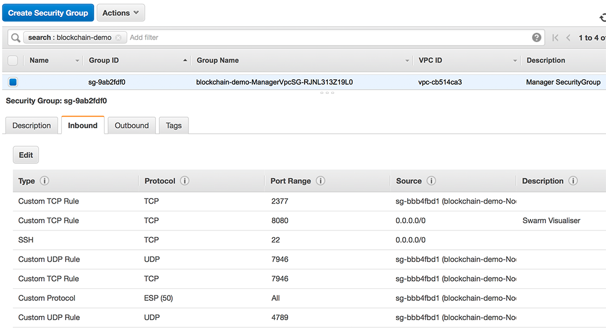

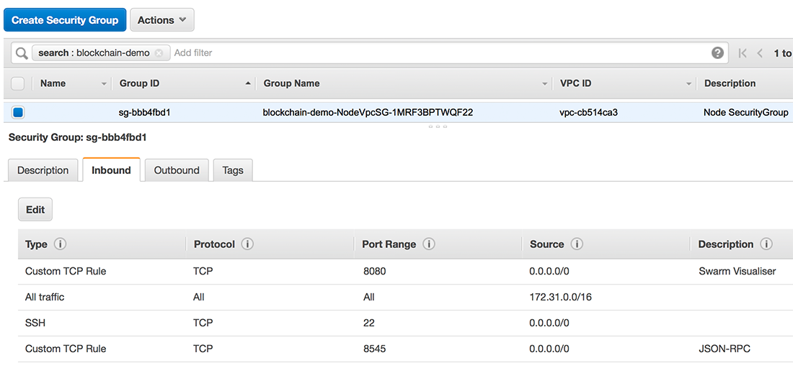

### Deploying blockchain nodes

We are ready to deploy our blockchain nodes.

First access the Swarm manager, either by using Docker for Mac or by copying
the *connect* command from the Docker Cloud:

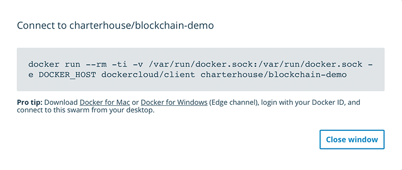

and pasting in into your terminal session:

```bash
$ docker run --rm -ti -v /var/run/docker.sock:/var/run/docker.sock -e DOCKER_HOST dockercloud/client charterhouse/blockchain-demo
=> You can now start using the swarm charterhouse/blockchain-demo by executing:
	export DOCKER_HOST=tcp://127.0.0.1:32770
$ export DOCKER_HOST=tcp://127.0.0.1:32770
```

We are now connected to the Swarm manager and we can see the nodes in our swarm by doing:

```
% docker node ls
ID                            HOSTNAME                        STATUS              AVAILABILITY        MANAGER STATUS
fhxrtp5e5sxjtaa18nx1577h6     ip-172-31-25-127.ec2.internal   Ready               Active
vegyy3w9eam8bgvj4q8s8z7to     ip-172-31-27-189.ec2.internal   Ready               Active
gzn6ur9ymazrvwsj8klbjojm7 *   ip-172-31-34-190.ec2.internal   Ready               Active              Leader
87bxai2z2isx4kvo48pcpvygi     ip-172-31-38-41.ec2.internal    Ready               Active
0rcpzwf9sx9gwmakwvj92lim9     ip-172-31-41-119.ec2.internal   Ready               Active
```

We are ready to deploy our stacks.

We have two separate stacks: `boot-stack` and `nodes-stack`. `boot-stack` is 
for deploying `bootnode`, `visualizer`, and to create the overlay network 
over which all our nodes will communicate. The `nodes-stack` will deploy 
the nodes and, optionally, dedicated miners.

### Deploying the `boot-stack`

Here is the docker compose file for the bootstack (`boot-stack.yml`):

```yaml
version: "3.4"
services:
  bootnode:
    image: charterhouse/blockchain-bootnode:v0.3
    deploy:
      placement:
        constraints:
          - node.role == manager
      restart_policy:
        condition: on-failure
    ports:
      - target: 30301
        published: 30301
        protocol: tcp
        mode: host
    volumes:
      - type: volume
        source: data
        target: /node/data
    networks:
      - blockchain-net
  visualizer:
    image: dockersamples/visualizer:stable
    ports:
      - "8080:8080"
    volumes:
      - "/var/run/docker.sock:/var/run/docker.sock"
    deploy:
      placement:
        constraints:
          - node.role == manager
    networks:
      - blockchain-net
networks:
  blockchain-net:
volumes:
  data:

```

From the terminal (the one connected to the , we run:

```bash
% docker stack deploy -c boot-stack.yml boot
Creating network boot_blockchain-net
Creating service boot_bootnode
Creating service boot_visualizer
```

Now, from our AWS console we can grab public DNS of one of our nodes 
(does not matter which one) and we should be able to connect to the
visualizer to see all the deployed services:

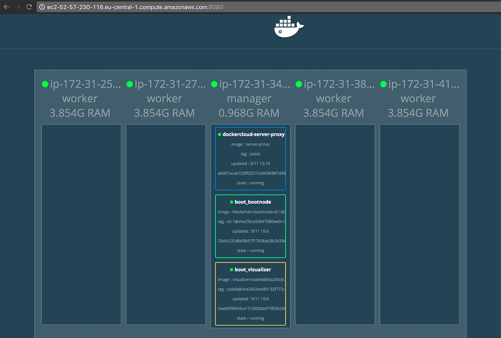

### Deploying the `nodes-stack`

In order to deploy the `nodes-stack`, we need to know the `enode url` of the `bootnode`.
Therefore, from our Swarm Manager console we need to connect to our bootnode in order
to learn its `enode url`:

```bash
$ docker exec -it 23c6c232db69 /bin/bash
root@23c6c232db69:/node# cat blockchain.log
WARN [11-09|15:06:44] No etherbase set and no accounts found as default
INFO [11-09|15:06:44] Starting peer-to-peer node               instance=Geth/v1.7.2-stable-1db4ecdc/linux-amd64/go1.9
INFO [11-09|15:06:44] Allocated cache and file handles         database=/node/data/geth/chaindata cache=128 handles=1024
WARN [11-09|15:06:44] Upgrading database to use lookup entries
INFO [11-09|15:06:44] Initialised chain configuration          config="{ChainID: 5 Homestead: 0 DAO: <nil> DAOSupport: false EIP150: <nil> EIP155: 0 EIP158: 0 Byzantium: <nil> Engine: unknown}"
INFO [11-09|15:06:44] Disk storage enabled for ethash caches   dir=/node/data/geth/ethash count=3
INFO [11-09|15:06:44] Disk storage enabled for ethash DAGs     dir=/root/.ethash          count=2
INFO [11-09|15:06:44] Initialising Ethereum protocol           versions="[63 62]" network=5
INFO [11-09|15:06:44] Loaded most recent local header          number=0 hash=868042…14a7a3 td=131072
INFO [11-09|15:06:44] Loaded most recent local full block      number=0 hash=868042…14a7a3 td=131072
INFO [11-09|15:06:44] Loaded most recent local fast block      number=0 hash=868042…14a7a3 td=131072
INFO [11-09|15:06:44] Regenerated local transaction journal    transactions=0 accounts=0
INFO [11-09|15:06:44] Starting P2P networking
INFO [11-09|15:06:44] Database deduplication successful        deduped=0
INFO [11-09|15:06:46] UDP listener up                          self=enode://96e26cf742db3f4bd74d7f7e11e87d83abba370e227756f3da735a902c3c07584f3bc077d1988091a91f68c0f0dec3a23704948ebe061c1a0484f63f63054ae4@[::]:30301
INFO [11-09|15:06:46] RLPx listener up                         self=enode://96e26cf742db3f4bd74d7f7e11e87d83abba370e227756f3da735a902c3c07584f3bc077d1988091a91f68c0f0dec3a23704948ebe061c1a0484f63f63054ae4@[::]:30301
INFO [11-09|15:06:46] IPC endpoint opened: /node/data/geth.ipc
```

We can also test if the `ipc` communication channel works and do:

```bash
root@23c6c232db69:/node# geth attach ipc:/node/data/geth.ipc
Welcome to the Geth JavaScript console!

instance: Geth/v1.7.2-stable-1db4ecdc/linux-amd64/go1.9
 modules: admin:1.0 debug:1.0 eth:1.0 miner:1.0 net:1.0 personal:1.0 rpc:1.0 txpool:1.0 web3:1.0

> admin.nodeInfo.enode
"enode://96e26cf742db3f4bd74d7f7e11e87d83abba370e227756f3da735a902c3c07584f3bc077d1988091a91f68c0f0dec3a23704948ebe061c1a0484f63f63054ae4@[::]:30301"
> admin.peers
[]
```

From the output above, we see that currently there are no other nodes connected.

In order to have a valid `enode url` we still need to replace `[::]` in 
the `enode url` above with the private IP of the Swarm Manager 
(where the `bootnode` is deployed). We read this private IP from the AWS EC2 Dashboard.
Our complete `enode url` is:

```
enode://96e26cf742db3f4bd74d7f7e11e87d83abba370e227756f3da735a902c3c07584f3bc077d1988091a91f68c0f0dec3a23704948ebe061c1a0484f63f63054ae4@172.31.34.190:30301
```

We will this `enode url` in the `nodes-stack.yml` file as a value for the `command` property:

```yaml
version: "3.4"
services:
  node:
    image: charterhouse/blockchain-node:v0.4
    command: ["*", "enode://96e26cf742db3f4bd74d7f7e11e87d83abba370e227756f3da735a902c3c07584f3bc077d1988091a91f68c0f0dec3a23704948ebe061c1a0484f63f63054ae4@172.31.34.190:30301"]
    deploy:
      mode: global
      restart_policy:
        condition: on-failure
      placement:
        constraints:
          - node.role != manager
    ports:
      - target: 30303
        published: 30303
        protocol: tcp
        mode: host
      - target: 8545
        published: 8545
        protocol: tcp
        mode: host
    volumes:
      - type: volume
        source: data
        target: /node/data
    networks:
      - boot_blockchain-net
volumes:
  data:
networks:
  boot_blockchain-net:
    external: true

```

NOTE: You can add multiple enode-urls in the command by appending the array.

Now, from the Swarm Manager terminal, we run:

```bash
$ docker stack deploy -c nodes-stack.yml nodes
Creating service nodes_node
```

We can confirm on the visualizer that the deployment was successful:

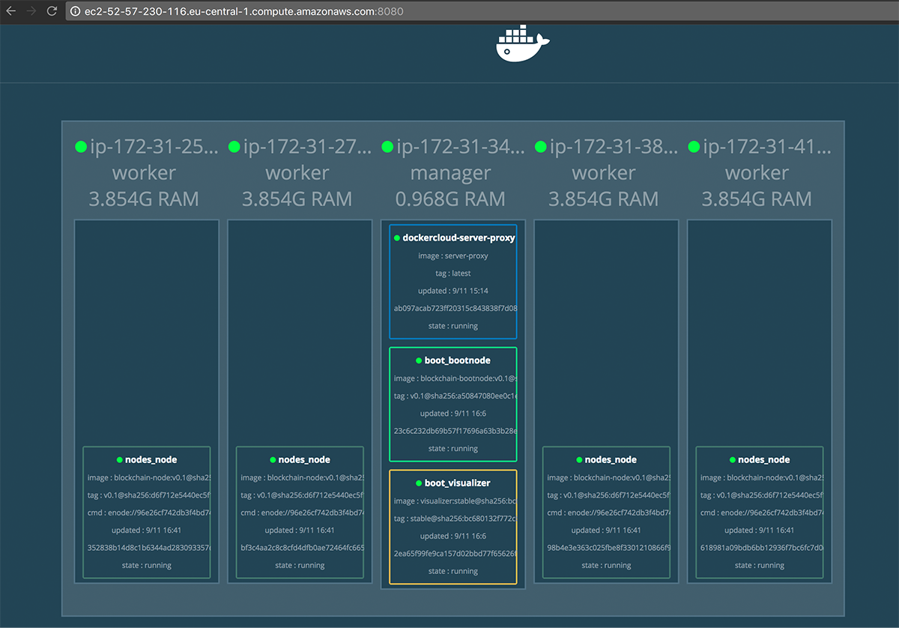

We can also verify that all nodes are connected to the `bootnode` by investigating
its `admin.peers` property as we have shown earlier above:

```bash
% docker exec -it 23c6c232db69 /bin/bash
root@23c6c232db69:/node# geth attach ipc:/node/data/geth.ipc
Welcome to the Geth JavaScript console!

instance: Geth/v1.7.2-stable-1db4ecdc/linux-amd64/go1.9
 modules: admin:1.0 debug:1.0 eth:1.0 miner:1.0 net:1.0 personal:1.0 rpc:1.0 txpool:1.0 web3:1.0

> admin.peers
[{
    caps: ["eth/63"],
    id: "43d51f7017fb1525fe66a2018086cf116d0ef8db235e9af14df5b1cd9d15eece0b325e7df1f75ac56c848190ddb15f5857b4df1a71c6390203f57e2bfc197397",
    name: "Geth/v1.7.2-stable-1db4ecdc/linux-amd64/go1.9",
    network: {
      localAddress: "172.18.0.5:30301",
      remoteAddress: "172.31.41.119:33404"
    },
    protocols: {
      eth: {
        difficulty: 131072,
        head: "0x868042dae1e42f31144d7e19a3e2917adecbd9314ecf4e83d203f91ea614a7a3",
        version: 63
      }
    }
}, {
    caps: ["eth/63"],
    id: "46d6a2cdb7721bc880e37391dca35093ac71d21be50c2f8a636633ef452cbdb2901b798241b09fcdc3acb2e7623de1c04afe57bf1dfc351dfacd105436672cd5",
    name: "Geth/v1.7.2-stable-1db4ecdc/linux-amd64/go1.9",
    network: {
      localAddress: "172.18.0.5:30301",
      remoteAddress: "172.31.25.127:45660"
    },
    protocols: {
      eth: {
        difficulty: 131072,
        head: "0x868042dae1e42f31144d7e19a3e2917adecbd9314ecf4e83d203f91ea614a7a3",
        version: 63
      }
    }
}, {
    caps: ["eth/63"],
    id: "59085eb39ee57b62c3576f2ecbedae0af73acbbe5766cdf58bd8acd88b2ee0ddbb481442f43e896e41325403d65db699419f140136a5873f84691bcd04cd3bc8",
    name: "Geth/v1.7.2-stable-1db4ecdc/linux-amd64/go1.9",
    network: {
      localAddress: "172.18.0.5:30301",
      remoteAddress: "172.31.27.189:37212"
    },
    protocols: {
      eth: {
        difficulty: 131072,
        head: "0x868042dae1e42f31144d7e19a3e2917adecbd9314ecf4e83d203f91ea614a7a3",
        version: 63
      }
    }
}, {
    caps: ["eth/63"],
    id: "b50d3c81de6776f381db1bccc5ebdad0fb1d9013eff038eb0c9d8a62c1e14a6c2c6426b2fa8980cadfc06986de1d5a1ab10b14712984cfeb990966888a09fdf2",
    name: "Geth/v1.7.2-stable-1db4ecdc/linux-amd64/go1.9",
    network: {
      localAddress: "172.18.0.5:30301",
      remoteAddress: "172.31.38.41:49364"
    },
    protocols: {
      eth: {
        difficulty: 131072,
        head: "0x868042dae1e42f31144d7e19a3e2917adecbd9314ecf4e83d203f91ea614a7a3",
        version: 63
      }
    }
}]
>
```

Our network is ready to use.

### Setting up Ethereum accounts

In order to setup an Ethereum account for a blockchain node, we need to login first to this node.
From a separate terminal:

```bash
ssh -i ~/.ssh/aws/blockchainlab.pem docker@ec2-18-195-85-73.eu-central-1.compute.amazonaws.com
The authenticity of host 'ec2-18-195-85-73.eu-central-1.compute.amazonaws.com (18.195.85.73)' can't be established.
ECDSA key fingerprint is SHA256:fDFy4ZF6a7C61cFgIhuTREAr7qnU7nbkFVMGwQGI2q8.
Are you sure you want to continue connecting (yes/no)? yes
Warning: Permanently added 'ec2-18-195-85-73.eu-central-1.compute.amazonaws.com,18.195.85.73' (ECDSA) to the list of known hosts.
Welcome to Docker!
~ $ docker container ls
CONTAINER ID        IMAGE                                COMMAND                  CREATED             STATUS              PORTS                                              NAMES
bf3c4aa2c8c8        charterhouse/blockchain-node:v0.1    "/node/start.sh en..."   29 minutes ago      Up 29 minutes       0.0.0.0:8545->8545/tcp, 0.0.0.0:30303->30303/tcp   nodes_node.vegyy3w9eam8bgvj4q8s8z7to.j6bqcf5oyqv6venqtqpgy47js
bf071c22b131        docker4x/guide-aws:17.09.0-ce-aws1   "/entry.sh"              2 hours ago         Up 2 hours                                                             guide-aws
387e29570a30        docker4x/shell-aws:17.09.0-ce-aws1   "/entry.sh /usr/sb..."   2 hours ago         Up 2 hours          0.0.0.0:22->22/tcp                                 shell-aws
~ $
```

Now, we can connect to the container and then to ethereum node using `ipc` channel and create user account:

```bash
~ $ docker exec -it bf3c4aa2c8c8 /bin/bash
root@bf3c4aa2c8c8:/node# geth attach ipc:/node/data/geth.ipc
Welcome to the Geth JavaScript console!

instance: Geth/v1.7.2-stable-1db4ecdc/linux-amd64/go1.9
 modules: admin:1.0 debug:1.0 eth:1.0 miner:1.0 net:1.0 personal:1.0 rpc:1.0 txpool:1.0 web3:1.0

> personal.newAccount()
Passphrase:
Repeat passphrase:
"0x28825f00d57a8566265a7182c906b59ad9233f7f"
>
```

> In all our example we use the same password for each account: `test`

### Connecting to the node with Mist

In order to connect to the node with Mist, run the following command:

```bash
$ /Applications/Mist.app/Contents/MacOS/Mist --rpc http://18.195.85.73:8545 --swarmurl "null"
```

This will start a new window where you will see the account number that we just created:


Now, back from the geth console session, we can start mining and, after some time, 
see the account balance on the Mist wallet increasing:

```bash
> miner.start(4)
null
```

> `4` above is for number of threads. You can stop mining by doing `miner.stop()`.

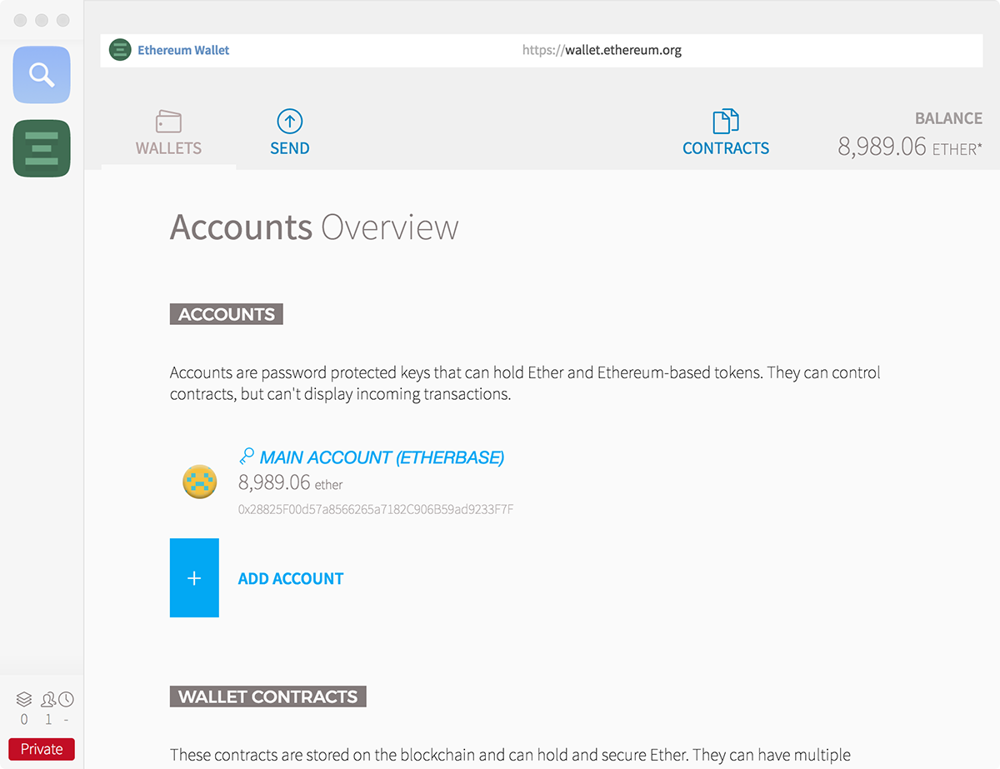

In order to complete the setup, follow the above steps for other nodes.

## Adding SSL to your blockchain

There are many ways. In our approach, we setup a proxy on the manager node. This proxy will let us connect securely using *https* and it will forward the calls to the suitable nodes. Our proxy will run on the manager role, so make sure that the instance where the manager runs, has associated an elasticIP from AWS. This way, we can be assured that all the following steps will be based on the stable IP address.

We need to perform the following steps:

1. Register a domain and setup DNS for the selected subdomain so that it uses AWS Route 53 as the DNS Service.
2. Obtain certificates for the proxy using [Let's Encrypt](https://letsencrypt.org).
3. Deploy a separate proxy stack on our blockchain swarm.

### Get your domain and setup DNS

You will need to get your domain first. Does not matter where, 
just make sure you can add *NS* records in your DNS zone.

Then, follow the steps from the following two tutorials from AWS:

1. [Creating a Subdomain That Uses Amazon Route 53 as the DNS Service without Migrating the Parent Domain](https://docs.aws.amazon.com/Route53/latest/DeveloperGuide/CreatingNewSubdomain.html)
2. [Routing Traffic to an Amazon EC2 Instance](https://docs.aws.amazon.com/Route53/latest/DeveloperGuide/routing-to-ec2-instance.html)

After this you should be able to reach your swarm manager using the registered domain.

### Get your certs from Let's Encrypt

We use [certbot](https://certbot.eff.org/) to acquire the certificates from Let's Encrypt.
Our proxy will be running in docker container, and our host OS is also very docker specific. This means we need to try one of the alternate installation method. Getting the certs with Docker looks easy and is described in [Running with Docker](https://certbot.eff.org/docs/install.html#running-with-docker). We run the docker command from our swarm manager node.

The actual command that we used to retrieve our certificates was:

```bash
docker run -it -p 443:443 -p 80:80 --name letsencrypt \ 
    -v "/home/docker/proxy/etc/letsencrypt:/etc/letsencrypt" \ 
    -v "/home/docker/proxy/var/lib/letsencrypt:/var/lib/letsencrypt" \
    -v "/home/docker/proxy/var/log/letsencrypt:/var/log/letsencrypt" \
    certbot/certbot certonly --verbose
```

> Just if you are curious, we tried to use a more convenient volume mapping and we actually tried the following command:
>
>   ```bash
>    docker run -it -p 443:443 -p 80:80 --name certbot \ 
>      -v "/etc/letsencrypt:/etc/letsencrypt" \ 
>      -v "/var/lib/letsencrypt:/var/lib/letsencrypt" \
>      -v "/var/log/letsencrypt:/var/log/letsencrypt" \
>      certbot/certbot certonly
>    ```
>
> It did not work... We received the confirmation that certificates were successfully generated, but the files were not written. We tried playing with permissions, running the command with `sudo`, etc, and it did not help. Finally, we changed the `--name` param from `certbot` to `letsencrypt` and we use a subfolder of our home folder as the source in the volume param. This worked. Additionally, the output of the command included agreement to terms and conditions, asking for the email address, and well it worked. We also used verbose mode to see more details, and in the moment of panic (well, the number of attempts per week is limited to 5), we also found there is a `--test-cert` option which is great for testing without actually generating the certificates. In the end this is something we wanted to document and we will provide more details when we have time to further test it.

In the verbose mode, at some point, you should see:

```bash
Creating directory /etc/letsencrypt/archive.
Creating directory /etc/letsencrypt/live.
Archive directory /etc/letsencrypt/archive/your-domain-name and live directory /etc/letsencrypt/live/your-domain-name created.
Writing certificate to /etc/letsencrypt/live/your-domain-name/cert.pem.
Writing private key to /etc/letsencrypt/live/your-domain-name/privkey.pem.
Writing chain to /etc/letsencrypt/live/your-domain-name/chain.pem.
Writing full chain to /etc/letsencrypt/live/your-domain-name/fullchain.pem.
Writing README to /etc/letsencrypt/live/your-domain-name/README.
```

After certs where retrieved successfully, we moved them to `/etc/letsencrypt` folder on the swarm manager EC2 instance.

> Note that in the log message above, it says that the certs are written to the `/etc/letsencrypt` folder. But actually it writes the certs to `/home/docker/proxy/etc/letsencrypt` - we provide this mapping in our docker command above.

If you run the above docker command from the `proxy` folder, then the output of this command be put into two folders: `etc` and `var`. The `var` folder is just to get the logs from running certificate generation - if is safe to remove that folder after certificates were generated.

So your proxy folder should have the following content:

| path | description |
|------|-------------|
| html | In that folder you should put your `index.js` file. Its content will be served when you visit `https://your.domain.name/`. |
| nginx.conf | This is your nginx configuration file. Please see the section *Deploying proxy stack* below. |
| etc | The output of certificate generation process. You can move it around, but we advise to keep it somewhere under your home folder (so no in `/etc`, etc). If you put it in a place that normally requires `sudo` access, the nginx may have problem. |
| var | The output of certificate generation process. Contains the logs of the certificate generation process. Will not be used after that and it is safe to remove this file after certs are generated |
| log | Logs of the nginx server. Very handy of starting the container failed. |


You can always see all the cert generation attempts for your domain using [https://crt.sh/](https://crt.sh/).

#### Further reading

1. [Certbot command-line options](https://certbot.eff.org/docs/using.html#certbot-command-line-options).
2. [SSL with Docker Swarm, Let's Encrypt and Nginx](https://finnian.io/blog/ssl-with-docker-swarm-lets-encrypt-and-nginx/),
3. [certbot/certbot](https://hub.docker.com/r/certbot/certbot/) on docker hub.
4. [certbot on github](https://github.com/certbot/certbot).
5. [Cerbot home page](https://certbot.eff.org/).
6. [How To SSL Ethereum Geth Node?](https://ethereum.stackexchange.com/questions/26026/how-to-ssl-ethereum-geth-node).
7. [Understanding Nginx Server and Location Block Selection Algorithms](https://www.digitalocean.com/community/tutorials/understanding-nginx-server-and-location-block-selection-algorithms).
8. [404 for .well-known/acme-challenge](https://community.letsencrypt.org/t/404-for-well-known-acme-challenge/38381).
9. [Beginner’s Guide](http://nginx.org/en/docs/beginners_guide.html).
10. [How nginx processes a request](http://nginx.org/en/docs/http/request_processing.html).


### Deploying proxy stack

We use nginx as the proxy server and we use the following template for the `nginx.conf` (see the `proxy/build/` folder):

```
user nginx;
worker_processes 1;

error_log /var/log/nginx/error.log warn;
pid /var/run/nginx.pid;

events {
  worker_connections 1024;
}

http {
  include /etc/nginx/mime.types;
  default_type application/octet-stream;

  log_format  main  '$remote_addr - $remote_user [$time_local] "$request" '
                    '$status $body_bytes_sent "$http_referer" '
                    '"$http_user_agent" "$http_x_forwarded_for"';

  access_log /dev/stdout main;
  sendfile on;
  keepalive_timeout 600;

  upstream node_1 {
    server {{node-1}}:8545;
    keepalive 100;
  }

  upstream node_2 {
    server {{node-2}}:8545;
    keepalive 100;
  }

  upstream node_3 {
    server {{node-3}}:8545;
    keepalive 100;
  }

  upstream node_4 {
    server {{node-4}}:8545;
    keepalive 100;
  }

  upstream faucet {
    server {{faucet}}:3001;
    keepalive 100;
  }

  server {
    # redirect from http to https
    listen 80;
    server_name  _;
    return 301 https://$host$request_uri;
  }

  server {
    listen              443 ssl;
    server_name         {{proxy-domain}};
    ssl_certificate     /etc/letsencrypt/live/{{proxy-domain}}/fullchain.pem;
    ssl_certificate_key /etc/letsencrypt/live/{{proxy-domain}}/privkey.pem;
    ssl_protocols       TLSv1 TLSv1.1 TLSv1.2;
    ssl_ciphers         HIGH:!aNULL:!MD5;

    location / {
       root   /usr/share/nginx/html;
       index  index.html;
    }

    location /vis/ {
      proxy_pass http://{{proxy-domain}}:8080/;
    }

    location /node-1 {
       proxy_pass http://node_1;
       proxy_connect_timeout       600;
       proxy_send_timeout          600;
       proxy_read_timeout          600;
       send_timeout                600;
       proxy_http_version 1.1;
       proxy_set_header Connection "";
    }

    location /node-2 {
       proxy_pass http://node_2;
       proxy_connect_timeout       600;
       proxy_send_timeout          600;
       proxy_read_timeout          600;
       send_timeout                600;
       proxy_http_version 1.1;
       proxy_set_header Connection "";
    }

    location /node-3 {
       proxy_pass http://node_3;
       proxy_connect_timeout       600;
       proxy_send_timeout          600;
       proxy_read_timeout          600;
       send_timeout                600;
       proxy_http_version 1.1;
       proxy_set_header Connection "";
    }

    location /node-4 {
       proxy_pass http://node_4;
       proxy_connect_timeout       600;
       proxy_send_timeout          600;
       proxy_read_timeout          600;
       send_timeout                600;
       proxy_http_version 1.1;
       proxy_set_header Connection "";
    }

    location /faucet/ {
       proxy_pass http://faucet/;
       proxy_connect_timeout       600;
       proxy_send_timeout          600;
       proxy_read_timeout          600;
       send_timeout                600;
       proxy_http_version 1.1;
       proxy_set_header Connection "";
    }
  }
}
```

In order to generate the ready to use configuration, please use the provided `build.py` script (also in `proxy/build/`). In this file, on top, please provide the suitable replacements. Currently we use `proxy-domain` to be the domain we registered earlier, `faucet` points to the node running the faucet, and `node-1`, `node-2`, `node-3`, `node-4` are the actual geth nodes:

```python
variables = {
  'proxy-domain': 'blockchain.example.com',
  'faucet': 'ec2-1-1-1-10.eu-central-1.compute.amazonaws.com',
  'node-1': 'ec2-1-1-1-1.eu-central-1.compute.amazonaws.com',
  'node-2': 'ec2-1-1-1-2.eu-central-1.compute.amazonaws.com',
  'node-3': 'ec2-1-1-1-3.eu-central-1.compute.amazonaws.com',
  'node-4': 'ec2-1-1-1-4.eu-central-1.compute.amazonaws.com'
}
```

Then from the `build` folder, just run

```bash
$ python3 build.py
```

This will produce a `nginx.conf` file in the parent folder.

> You can find the actual config file for our network in our Keybase team folder.

Finally, the proxy stack (`proxy-stack.yml`):

```yaml
version: '3.4'

services:  
  nginx:
    image: nginx:stable-alpine
    volumes:
      - /home/docker/proxy/etc/letsencrypt:/etc/letsencrypt
      - /home/docker/proxy/html:/usr/share/nginx/html
      - /home/docker/proxy/nginx.conf:/etc/nginx/nginx.conf
      - /home/docker/proxy/log:/var/log/nginx
    deploy:
      mode: global
      placement:
        constraints:
          - node.role == manager
    ports:
      - 80:80
      - 443:443
```

Make sure that all the paths in the `volumes` section above exist on the EC2 instance corresponding to the swarm manager node.

Finally, from the manager node, run:

```bash
$ docker stack deploy -c proxy-stack.yml proxy
```

With the given configuration that address of blockchain node `node-1` is `https://your.domain.name/node-1/`. You can also access visualizer using `https://your.domain.name/vis/`.


## Docker Images

In folders `bootnode`, `node`, and `miner` you will find the dockerfiles corresponding 
to the docker images used in the `boot-stack.yml` and `nodes-stack.yml` files. We published the ready to use images images on [Docker Hub](https://hub.docker.com). These are
`charterhouse/blockchain-bootnode:v0.3`, `charterhouse/blockchain-node:v0.4`, and 
`charterhouse/blockchain-miner:v0.1` respectively. For simplicity, in our current setup 
we do not use a separate miner.

In order to change images, for each image, run in the image directory:

```bash
$ docker build -t <your-image-tag> .
$ docker push <your-image-tag>
```

> If you push the images to Docker Hub, you will need to login using the `docker login` command. Login with **your** username, not `charterhouse`. 

## Assets in `private-blockchain.psd`

This is a photoshop file that contains all the image assets used in this `README.md` file.
All images in `private-blockchain-assets` directory are automatically generated 
using the Photoshop's image assets generation feature.
